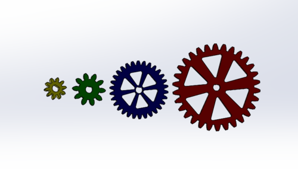
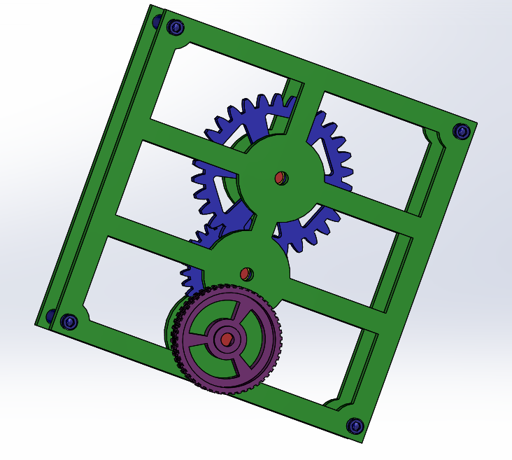
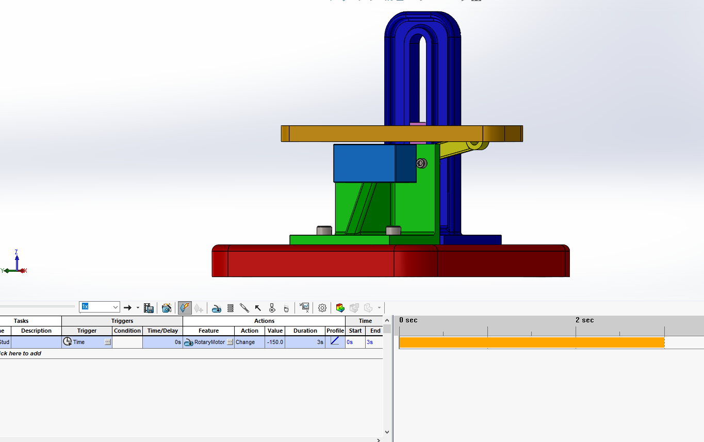
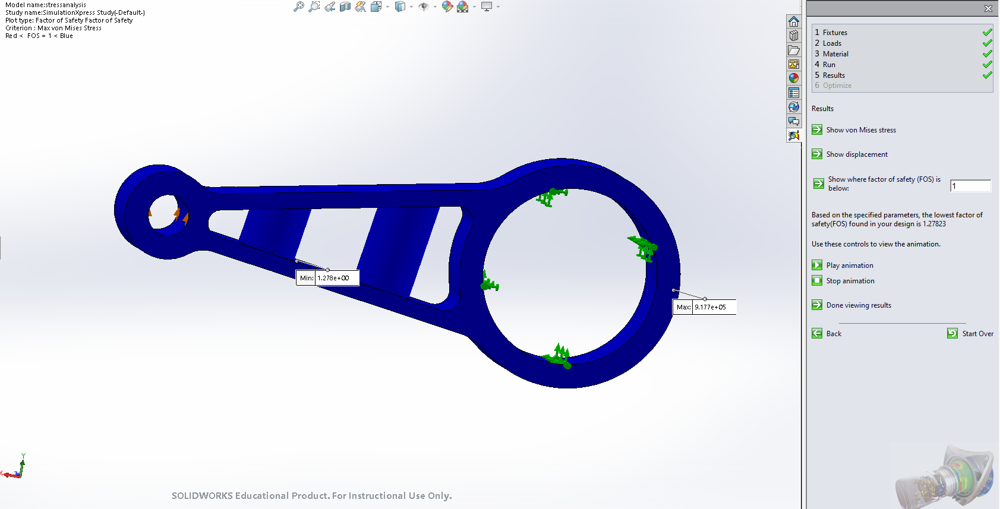

# Advanced CAD
Solidworks assignments for the robot arm project (some are from Engineering 2 and some have been modified for the project)

## Gears
### Objective
Create 4 different configurations of gears using equations to define variables
### Picture

### Lessons & Methods
In this assignment, I learned that equations can be used in Solidworks, meaning that changing a value will change related values proportionally, and create a similarly shaped part.

## Gearbox
### Objective
Use the gears from the last assignment and build a box where all the gears turn together when you turn a knob.
### Picture

### Lessons & Methods
In this assignment, I relearned how to use revolved base and cut (in the knob part) and learned how to use gear mates in the assembly.

## Motion Study
### Objective
Build a contraption where a servo arm pushes a shelf up, and then use a motion study to see this in action
### Picture

### Lessons & Methods
In this assignment, I learned how to set up a motion study, by defining gravity, a motor, and selecting parts that will move when contacting each other. Additionally, I learned how to use a shell cut in creating many of the individual parts.	

## Stress Analysis
### Objective
Build and then modify a solidworks part to have a Factor of Safety between 1 and 2
### Picture

### Lessons & Methods
In this assignment, I learned how to run the Simulation Express Analysis Wizard, which will tell you how much force is on different parts of an object.  In order to make the part safe, but not unnecesarilly bulky, I created two circular columns to help support the middle cut of the part.
